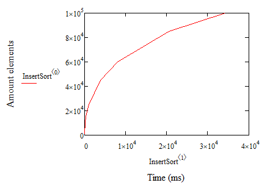
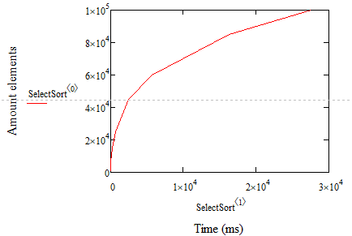
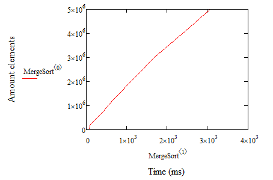
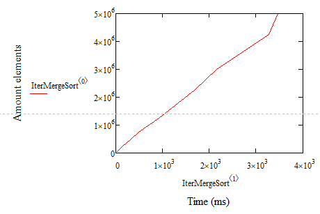
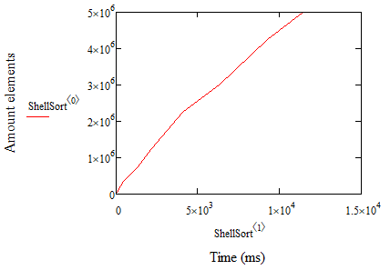

Ельчанинов Дмитрий ИБ-119
# Лабораторная работа №2.
## Сравнение различных сортировок по времени выполнения.

## Результаты измерений
На графиках время отображено в милисекундах на оси Х, на оси Y отображено количество входных данных.

Сортировка Вставками:

Сортировка Выбором:

Сортировка Слиянием:

Сортировка Слиянием (без рекурсии):

Сортировка Шелла:

