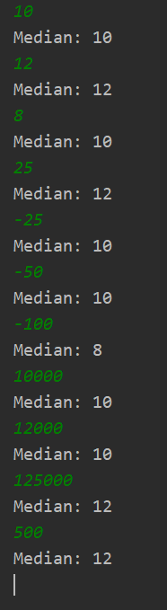

Ельчанинов Дмитрий ИБ-119
# Лабораторная работа №3.
## Нахождение медианы в потоке целых чисел.

Для реализации решения данной задачи я использовал следующий алгоритм:
 1. Числа сохраняются в массив. Изначальный размер массива указывается при объявлении экземпляра класса ArrayMedian.
 2. При добавлении нового элемента производится бинарный поиск по массиву, чтобы найти подходящий индекс для этого элемента и освободить под него место.
 3. Если массив заполняется, то он заменяется на массив в два раза больший по длине.

## Пример выполнения программы

