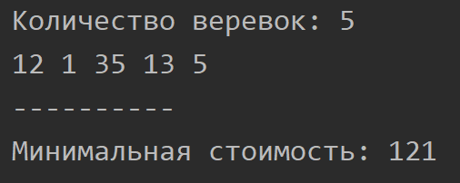

Ельчанинов Дмитрий ИБ-119
# Лабораторная работа №4.
Даны n веревок разной длины, нам нужно соединить эти веревки в одну веревку. Стоимость соединения двух веревок равна сумме их длин. Нам нужно соединить веревки с минимальными затратами: требуется вывести последовательность таких соединений и совокупную стоимость.

Для нахождения минимальной цены соединения нужно складывать элементы в подрядке возрастания.

### Образец работы программы

