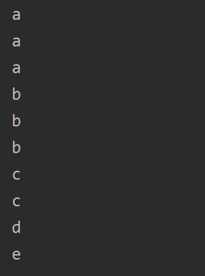

Ельчанинов Дмитрий ИБ-119
# Лабораторная работа №7.
Отсортируйте массив по частоте элементов: то есть, элементы, которые имеют более высокую частоту, должны находиться на первом месте. Если частоты двух элементов одинаковы, то меньшее число идет первым. Для решения этой задачи используйте хэш-таблицы.

Сначала подсчитываем количество вхождений элементов в массив, сохраняем значения в хеш таблицу. Сортируем полученные данные, выводим результат.

### Пример работы программы:
Входные данные: "a a b c c b b d a e"

